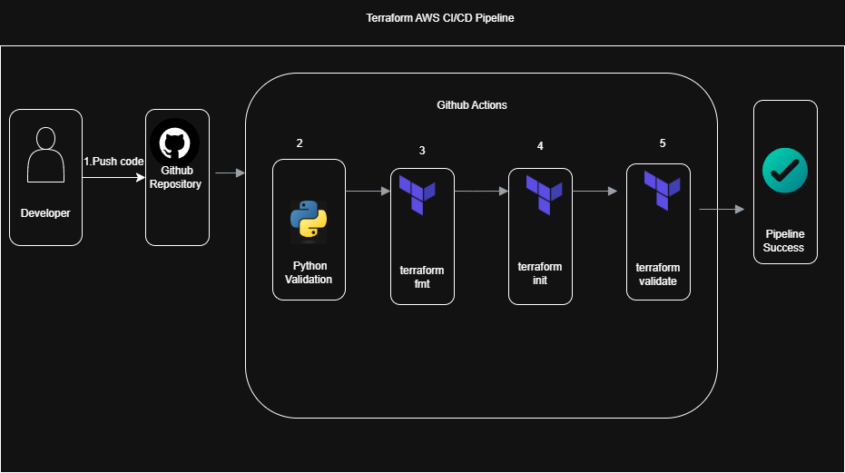

# Terraform AWS CI/CD Pipeline

[](https://github.com/Fadila-Yiddana/terraform-aws-cicd-pipeline/actions/workflows/terraform.yml)

## Project Overview

This project demonstrates how to build a production-style CI/CD pipeline for Terraform using GitHub Actions and Python.

Every time code is pushed to GitHub, the pipeline automatically validates the Terraform project before infrastructure can be deployed.

This project demonstrates Infrastructure as Code (IaC), automation, continuous integration, and cloud engineering best practices.

---

## Architecture

<p align="center">

</p>

---

## Pipeline Workflow

1. Developer pushes code to GitHub.
2. GitHub Actions starts automatically.
3. Python validates the project structure.
4. Terraform formatting is checked.
5. Terraform initialization runs.
6. Terraform validation is performed.
7. Pipeline reports success.

---

## Technologies Used

- Terraform
- GitHub Actions
- Python
- Git
- AWS
- Infrastructure as Code (IaC)

---

## Project Structure

```
terraform-aws-cicd-pipeline
│
├── .github/
│   └── workflows/
│       └── terraform.yml
│
├── terraform/
│   ├── versions.tf
│   ├── providers.tf
│   ├── main.tf
│   ├── variables.tf
│   └── outputs.tf
│
├── python/
│   └── validate.py
│
├── diagrams/
│   └── terraform-cicd-architecture.png
│
├── NOTES.md
├── .gitignore
└── README.md
```

---

## Learning Objectives

This project demonstrates:

- Infrastructure as Code
- CI/CD pipelines
- GitHub Actions
- Python automation
- Terraform validation
- Git workflow
- AWS Infrastructure

---

## Future Improvements

- Deploy infrastructure automatically
- Add Terraform Plan stage
- Add Terraform Apply stage
- Configure AWS authentication using GitHub Secrets
- Store Terraform state remotely in Amazon S3
- Add Terraform security scanning
- Add cost estimation

---

## Author

**Fadila Yiddana**

AWS Certified Solutions Architect – Associate

Cloud Engineer | Terraform | AWS | Python | GitHub Actions